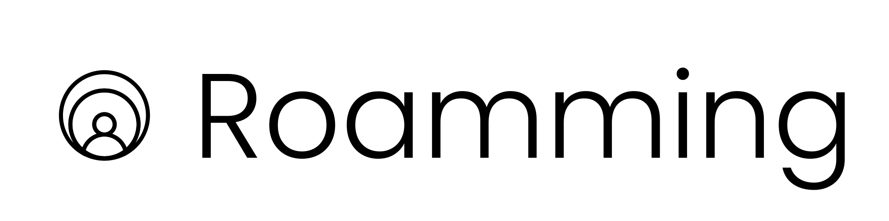

<p align="center">
  
</p>

# roamming

A system-tray desktop app (Go + [Fyne](https://fyne.io)) that sets **your own**
external activity indicator in [Roam](https://ro.am) via the
[`user.activity` API](https://developer.ro.am/docs/guides/user-activity):
a badge, tooltip text, glow color, optional Do-Not-Disturb and an optional
timer.

**Only your permissions, ever.** The app authenticates with a *personal* OAuth
grant and requests exactly two scopes:

- `user:write.activity`: set/clear your activity
- `user:read.activity`: list your live activities (all integrations)

It can never target another user: the API's personal access model restricts
every call to the token owner.

## Setup

1. Register an OAuth app in Roam: **Administration → Developer → Add ApiClient**
   (authorization type **OAuth**) with:
   - Redirect URI (exact match): `http://127.0.0.1:18079/callback`
   - Scopes: `user:write.activity`, `user:read.activity`
2. Copy the **Client ID** (and **Client Secret** only if you registered a
   confidential client; public/PKCE clients leave it empty).
3. Run the app, paste the Client ID, hit **Connect with Roam**.

The app starts a **temporary, stdlib-only `net/http` server** on
`127.0.0.1:18079`, opens your browser at `https://ro.am/oauth/authorize`
(authorization-code flow, **PKCE S256**, CSRF `state` check), captures the
redirect, exchanges the code, resolves your identity via `token.info`, and
shuts the server down. Access tokens are refreshed automatically (7-day
lifetime, rotated refresh tokens); a revoked grant sends you back to the
connect screen.

## Build

Requires Go 1.24+ and the usual Fyne native dependencies:

```sh
# Debian/Ubuntu
sudo apt install build-essential pkg-config libgl1-mesa-dev xorg-dev libwayland-dev libxkbcommon-dev

go build -o roamming .
```

### Release

Pushing a `v*` tag runs GoReleaser on GitHub Actions: each OS builds
natively in a matrix (linux/amd64, darwin/amd64+arm64,
windows/amd64), and the archives are merged into a single GitHub
release with checksums:

```sh
git tag v0.1.0 && git push origin v0.1.0
```

The goreleaser configs live in `.goreleaser.yaml` (master view) and
`.goreleaser/<os>.yaml` (what CI actually runs per OS).

## Usage

- **Tray icon**: left-click opens the window, right-click opens the menu
  (status preview with live countdown, Start/Stop, Show window, Quit).
  Closing the window hides it; **Quit** clears the activity first.
- **Presets**: On a call, In a meeting, Focusing, … pre-fill the form.
- **Emoji**: pick from a curated grid or paste any emoji (≤ 16 code points).
- **Text**: status title (required) and subtitle (optional), ≤ 140 code points.
- **Glow color**: the 12 curated Roam palette names; *none* = quiet badge.
- **DND**: optionally locks your assigned office while the activity runs.
- **Timer (optional)**: 15 min … 8 h, or run until you stop it.

### End-time text: fixed or live countdown

Two user-selectable styles for timed activities:

- **Fixed end time** (default): the title gets `… · back at 15:04 BRT`
  (your local timezone), computed once at start. A timer within the
  server's 1-hour TTL posts **exactly once**; nothing re-posts until the
  final clear.
- **Live countdown**: the title gets `… · back in 24m`, re-posted every
  minute so the badge text ticks on the Roam map.

Open-ended activities (no timer) heartbeat every 15 minutes within a
30-minute TTL: deliberately few posts, at the cost of a badge that can
linger up to 30 minutes if the app dies without clearing. Timers longer
than 1 hour heartbeat every 45 minutes (the server clamps TTLs to one
hour). Stopping or quitting always clears the activity; a missed clear
also expires server-side within the TTL.

## Files & security

- Tokens live in `$XDG_CONFIG_HOME/roamming/credentials.json` (0600; on
  macOS/Windows under the user config dir). Anyone with read access to your
  user account can read them; treat this machine as the trust boundary.
- Last-used activity settings live in Fyne preferences.

## Layout

```
main.go                    app bootstrap
internal/roam/             API client, OAuth+PKCE+callback server, token store
internal/session/          activity lifecycle: set, heartbeats, timer, clear
internal/ui/               Fyne window, pickers, palette, tray icons
```

The embedded app icon (`internal/ui/appicon.png`) is a copy of
`docs/design/favicon.png`; after changing the artwork, run
`make update-logo` and rebuild.
